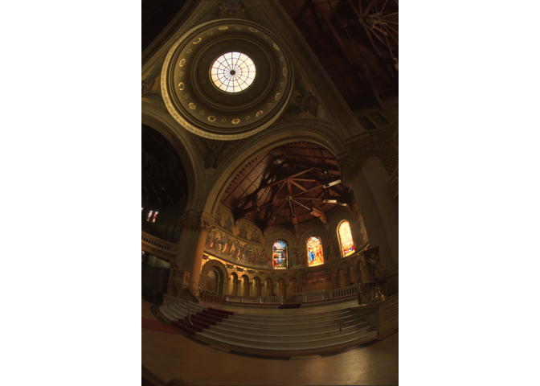

<!-- README.md is generated from README.Rmd. Please edit that file -->

# picohdr

<!-- badges: start -->


[](https://CRAN.R-project.org/package=picohdr)
[](https://github.com/coolbutuseless/picoexr-dev/actions/workflows/R-CMD-check.yaml)
<!-- badges: end -->

`{picohdr}` is a package for reading and writing HDR (High Dynamic
Range) images. Supported image types are types
[`PFM`](https://www.pauldebevec.com/Research/HDR/PFM/) and
[`EXR`](https://openexr.com/). Tools for tone-mapping HDR images and
adjusting array values are also included.

- `PFM` *Portable Float Map* is a very simple 2D and 3D array
  serialization format that is used to store floating point data for
  images.
- `EXR` is a more comprehensive HDR image standard, but `picohdr` only
  supports a commonly occurring feature subset:
  - Single-part scanline images only
  - Compression modes: `NONE`, `ZIP`, `ZIPS` (`ZIPS` support is for read
    only)
  - Parsing meta-information works on all image types (single-part,
    scanline, tiled, deep, and multi-part images)

The package name is `**pico**hdr` as it only addresses a very small (but
common) subset of the EXR image specification.

## What’s in the box

- PFM support
  - `read_pfm()`, `write_pfm()` for handling *Portable Float Map* (PFM)
    images
- EXR support
  - `read_exr()` for reading single-part scanline EXR images. Supports
    `NONE`, `ZIP` or `ZIPS` compression modes.
  - `write_exr()` for writing single-part scanline EXR images. Supports
    `NONE` and `ZIP` compression modes.
  - `exr_info()` return information about an EXR file. Supports
    single-part, multi-part, tiled and deep images.
- Tone mapping for converting from HDR to LDR (low dynamic range) raster
  image. These functions work hard to shift array values into the range
  \[0,1\] with the aim to approximate the look of the HDR image in a
  more limited medium.
  - `tm_reinhard()`  
  - `tm_reinhard_basic()`  
  - `tm_reinhard_variant()`
- General array adjustments
  - `adj_clamp()` clamp values outside the given limits
  - `adj_gamma()` gamma correction
  - `adj_infinite()` remove infinite values by setting them to the
    largest/smallest finite values
  - `adj_rescale()` linearly rescale all values into the given range
  - `adj_shift_negatives_global()` find the most negative value in the
    data and shift all values up by this amount so that there are no
    negatives.
  - `adj_shift_negatives_local()` same as the global method except the
    most negative value is found and adjusted on a per-channel basis.

# ToDo before release

- Add URL and BugReports URL
- General refactor
  - Put more information on the ‘info’ structure and pass that around
    instead of lots of arguments and repeated calculations.
- Doc pass
- Smaller image to get package size under 5meg

## Installation

You can install from [GitHub](https://github.com/coolbutuseless/picohdr)
with:

``` r
# install.packages('remotes')
remotes::install_github('coolbutuseless/picohdr')
```

## PFM

Load and display a *Portable Float Map* (`PFM`) image.

Apply tone-mapping to the image and adjust the gamma correction prior to
display.

``` r
filename <- "man/figures/memorial.pfm.bz2"
im <- read_pfm(filename)
dim(im)
```

    #> [1] 768 512   3

``` r
im |> 
  tm_reinhard() |>
  adj_gamma() |> 
  plot()
```



## EXR

In this section

- Load an EXR image
- Show the names of the channels in this image
- Plot the RGB channels (apply tone-mapping and gamma adjustment)
- Plot some other channels in the image
- Display the metainformation about an EXR image

``` r
library(picohdr)

# EXR file of meta-information about the rendered scene
filename <- system.file("image/rstats.exr", package = "picohdr") 

# Load all images
images <- read_exr(filename)
dim(im)
```

    #> [1] 768 512   3

``` r
# Channel names. EXR format wants channels arranged alphabetically
dimnames(images)[[3]]
```

    #>  [1] "Albedo.B"           "Albedo.G"           "Albedo.R"          
    #>  [4] "B"                  "G"                  "N.X"               
    #>  [7] "N.Y"                "N.Z"                "Ns.X"              
    #> [10] "Ns.Y"               "Ns.Z"               "P.X"               
    #> [13] "P.Y"                "P.Z"                "R"                 
    #> [16] "RelativeVariance.B" "RelativeVariance.G" "RelativeVariance.R"
    #> [19] "Variance.B"         "Variance.G"         "Variance.R"        
    #> [22] "dzdx"               "dzdy"               "u"                 
    #> [25] "v"

``` r
# Extract RGB channels. Tone-map. Adjust gamma.
images[,,c('R', 'G', 'B')] |>
  tm_reinhard() |>
  adj_gamma() |>
  plot()
```


``` r
# Plot the albedo Green channel
plot(images[, , 'Albedo.G'])
```


### Display a non-colour channel

This file includes information about the surface derivative at each
point in the image in the `dzdx` channel.

This value may be negative or positive, so we will map the values into
the standard range \[0, 1\] so it can be visualised.

``` r
# Rescale the derivative channel to the range [0,1] and display
images[,,'dzdx'] |>
  adj_rescale(0, 1) |> 
  plot()
```


### EXR metadata

``` r
exr_info(filename)
```

    #> $version
    #> $version$number
    #> [1] 2
    #> 
    #> $version$single_tile
    #> [1] FALSE
    #> 
    #> $version$long_name
    #> [1] FALSE
    #> 
    #> $version$non_image
    #> [1] FALSE
    #> 
    #> $version$multipart
    #> [1] FALSE
    #> 
    #> $version$desc
    #> [1] "single-part scanline"
    #> 
    #> 
    #> $channels
    #>                  name type pLinear xSampling ySampling
    #> 1            Albedo.B half       0         1         1
    #> 2            Albedo.G half       0         1         1
    #> 3            Albedo.R half       0         1         1
    #> 4                   B half       0         1         1
    #> 5                   G half       0         1         1
    #> 6                 N.X half       0         1         1
    #> 7                 N.Y half       0         1         1
    #> 8                 N.Z half       0         1         1
    #> 9                Ns.X half       0         1         1
    #> 10               Ns.Y half       0         1         1
    #> 11               Ns.Z half       0         1         1
    #> 12                P.X half       0         1         1
    #> 13                P.Y half       0         1         1
    #> 14                P.Z half       0         1         1
    #> 15                  R half       0         1         1
    #> 16 RelativeVariance.B half       0         1         1
    #> 17 RelativeVariance.G half       0         1         1
    #> 18 RelativeVariance.R half       0         1         1
    #> 19         Variance.B half       0         1         1
    #> 20         Variance.G half       0         1         1
    #> 21         Variance.R half       0         1         1
    #> 22               dzdx half       0         1         1
    #> 23               dzdy half       0         1         1
    #> 24                  u half       0         1         1
    #> 25                  v half       0         1         1
    #> 
    #> $compression
    #> [1] "ZIP"
    #> 
    #> $dataWindow
    #> [1]   0   0 419 279
    #> 
    #> $displayWindow
    #> [1]   0   0 419 279
    #> 
    #> $lineOrder
    #> [1] "increasing"
    #> 
    #> $pixelAspectRatio
    #> [1] 1
    #> 
    #> $renderTimeSeconds
    #> [1] 55.13455
    #> 
    #> $samplesPerPixel
    #> [1] 1024
    #> 
    #> $screenWindowCenter
    #> [1] 0 0
    #> 
    #> $screenWindowWidth
    #> [1] 1
    #> 
    #> $worldToCamera
    #>            [,1]       [,2]          [,3]       [,4]
    #> [1,]  0.7657048 -0.6431921 -1.233992e-09 -1.2251276
    #> [2,] -0.2218857 -0.2641496  9.386115e-01  0.1672952
    #> [3,] -0.6037076 -0.7186995 -3.449758e-01 14.9489479
    #> [4,]  0.0000000  0.0000000  0.000000e+00  1.0000000
    #> 
    #> $worldToNDC
    #>            [,1]       [,2]       [,3]      [,4]
    #> [1,]  5.9577274 -5.6173983 -0.1724879 -2.540855
    #> [2,] -2.1157532 -2.5187538  7.5005937  8.842100
    #> [3,] -0.6037106 -0.7187030 -0.3449775 14.944022
    #> [4,] -0.6037076 -0.7186995 -0.3449758 14.948948
    #> 
    #> $chunk_offsets
    #>  [1]    1210   92566  194283  315837  452402  596647  749869  910568 1075736
    #> [10] 1237960 1389836 1534520 1667815 1786078 1891476 1994114 2093994 2191602

## EXR Implementation Notes

The code for handling EXR images is mostly written in base R with the
exception of a core compression/decompression component which is written
in C:

The ZIP compression mode applies a predictor and de-interleaves bytes.
The byte predictor and interleaving can be in R but is 20x faster in C.

EXR support is for a subset of images which:

- consist of a single-part scanline image.
- use the `NONE`, `ZIP` or `ZIPS` compression

This package **does not** support the following EXR features:

- multi-part images
- deep images
- tiled images

If you would like support for these features please file an issue on
GitHub. A link to a free/openly-licensed image containing your requested
features would be appreciated.
